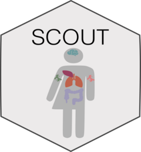

<!-- README.md is generated from README.Rmd. Please edit that file -->

# SCOUT <a href="https://caravagnalab.github.io/SCOUT/"></a>

<!-- badges: start -->

[](https://github.com/caravagnalab/SCOUT/actions/workflows/R-CMD-check.yaml)
<!-- badges: end -->

`SCOUT` is an R package for accessing data of the SCOUT cohort simulated
with [ProCESS](https://github.com/caravagnalab/ProCESS) package.

## Installation

You can install the current version of SCOUT from
[GitHub](https://github.com/) with:

``` r
# install.packages("devtools")
devtools::install_github("caravagnalab/SCOUT")
```

------------------------------------------------------------------------

#### Copyright and contacts

Cancer Data Science (CDS) Laboratory.

[](https://github.com/caravagnalab/)
[](https://www.caravagnalab.org/)
